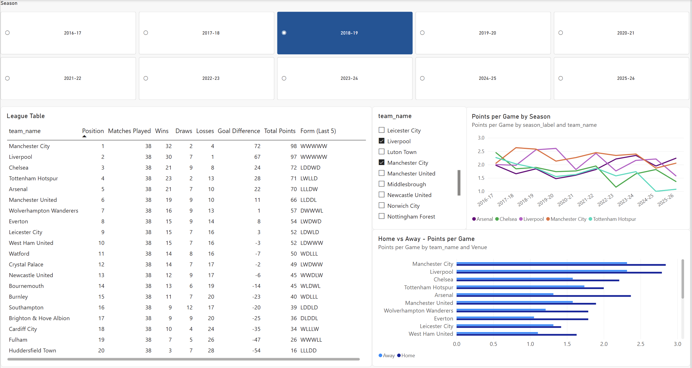
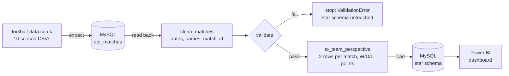
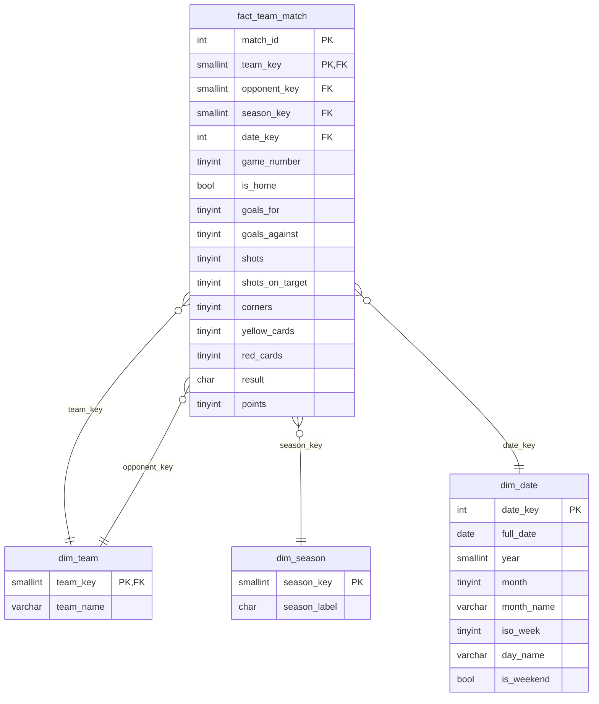

# Premier League Analytics Pipeline

A Python ETL pipeline that takes 10 seasons of real Premier League match data (2016-17 to 2025-26),
cleans and validates it, loads it into a star schema in MySQL, and feeds a Power BI dashboard.



*The dashboard with 2018-19 selected: Manchester City 98 points, Liverpool 97. Every number
matches the real final table.*

## What it does

```bash
python -m src.pipeline
```

One command downloads the season files, stages them in MySQL, cleans and reshapes them, runs data
quality checks, and rebuilds the star schema, in about half a second:

```
INFO  Extract: CSVs -> stg_matches
INFO    3800 matches staged
INFO  Transform (1/2): cleaning matches
INFO  Validate: running quality checks
INFO    all checks passed
INFO  Transform (2/2): reshaping to one row per team per match
INFO    7600 team rows
INFO  Load: rebuilding the star schema
INFO    dim_team            34 rows
INFO    dim_season          10 rows
INFO    dim_date          3572 rows
INFO    fact_team_match   7600 rows
INFO  Done in 0.5 s
```

## Pipeline



| Stage | File | What it does |
|---|---|---|
| Extract | `src/extract.py` | Downloads missing seasons, keeps the 20 needed columns by name, adds a `season` label, writes everything to the `stg_matches` staging table, then reads it back so MySQL acts as the source system |
| Transform | `src/transform.py` | Parses dates, renames columns, maps team names to full names, adds a chronological `match_id`, then reshapes each match into a home row and an away row with result and points |
| Validate | `src/validate.py` | Runs every data quality check and raises one error listing all problems. Runs **before** the reshape and load, so bad data never reaches the dashboard |
| Load | `src/load.py`, `sql/star_schema.sql` | Drops and recreates the star schema with explicit types, primary keys and foreign keys, then fills the dimensions and the fact table |
| Orchestration | `src/pipeline.py` | Runs the stages in order with one shared database connection, logs progress, and exits with code 1 if validation fails |

## Data source and the problems it had

Data comes from [football-data.co.uk](https://www.football-data.co.uk/englandm.php), one CSV per
season. The files are not consistent with each other, and handling that was part of the point:

| Problem | Seasons | How it's handled |
|---|---|---|
| Dates are `dd/mm/yy` in one file and `dd/mm/yyyy` in the others | 2016-17 | Each format is parsed explicitly, never guessed. A day-first/month-first guess like `05/08/2022` would give a valid but wrong date without any error |
| Some files start with an invisible byte order mark, so the first column reads as `Div` | 2021-22, 2024-25, 2025-26 | Read with `encoding="utf-8-sig"` |
| 62 to 132 columns depending on the season (mostly betting odds), plus a `Time` column from 2019-20 | All | Columns are selected by name, and a missing column stops extract with the file and column named |
| The `www.` address answers with a redirect, so a naive download saves an empty file and reports success | All | Download follows redirects and fails if the file is empty |
| `AS` (away shots) is a reserved word in SQL | All | Renamed to `away_shots` in transform |
| 2019-20 was paused by COVID and ends in July 2020 | 2019-20 | Still 380 matches, passes validation unchanged |
| Short team names (`Man United`, `Nott'm Forest`) | All | Mapped to full names. Every team is listed in the mapping, so an unknown name (e.g. a newly promoted team) stops the pipeline instead of slipping through |

## Star schema



**Grain: one row per team per match.** Each match appears twice, once from each team's point of
view. In the raw home/away format, "Arsenal's goals" means home goals when Arsenal is at home plus
away goals when Arsenal is away, and every Power BI measure would need that two-part logic. In the
team-perspective format it's just `SUM(goals_for)`, filtered to Arsenal. The cost is a table twice
as long, which is nothing at 7,600 rows.

Other decisions:

- **Surrogate keys** (`team_key`, `season_key`) instead of names in the fact table: small integer
  joins, and a team's display name can change in one place.
- **`date_key` as `yyyymmdd`** (e.g. `20250815`): unique, sorts like the date, readable at a glance.
- **`dim_date` covers every calendar day**, not just match days, so time-based visuals have no gaps.
- **`game_number`** (each team's 1st to 38th match of the season) makes "form over the last 5" and
  match-by-match charts simple in DAX.
- **`opponent_key` is a role-playing dimension:** a second link to `dim_team`. In Power BI it's an
  inactive relationship, since two active paths between the same tables would be ambiguous.
- **The schema is written in SQL** (`sql/star_schema.sql`), not inferred by pandas, so MySQL itself
  enforces types, `NOT NULL`, primary keys and foreign keys as a second safety net.

## Validation checks

Run on the cleaned match-level data, before reshaping. All checks run, and one `ValidationError`
lists every problem found. If anything fails, the pipeline stops and the star schema keeps its
previous, good data.

| Check | Catches |
|---|---|
| No missing values in key columns | Blank cells. Runs first, because a missing score would otherwise show up as a misleading "wrong result" |
| No duplicate matches (same date, home team and away team) | A file loaded twice, a match counted twice |
| Goals, shots, corners and cards are never negative | Corrupt or mis-entered data |
| Full-time result agrees with the score | Shifted or mixed-up columns |
| Every season has 380 matches and 20 teams | Missing or truncated files, misspelled team names |

Example output on deliberately broken data (abridged):

```
Data failed 6 quality check(s):
  - 1 missing values in 'away_goals'
  - 2 rows are duplicate matches, e.g. Burnley vs Swansea City on 2016-08-13
  - 1 negative values in 'home_shots'
  - 2 matches where the result disagrees with the score, e.g. match_ids [11, 21]
  - 2016-17: 381 matches, expected 380
  - 2024-25: 376 matches, expected 380
```

## Dashboard

Built in Power BI Desktop on the star schema (`dashboard/premier_league.pbix`), with all DAX
measures in a separate `_Measures` table:

- **League table by season:** position, W/D/L, goal difference, points and form over the last 5
  matches, driven by a single-select season slicer.
- **Points per game by season:** one line per selected team across all 10 seasons. It ignores the
  season slicer and follows a team slicer instead.
- **Home vs away:** points per game at home and away for every team in the selected season.

Key measures: Total Points, Wins/Draws/Losses, Goal Difference, Win %, Points per Game,
Position (`RANKX` with goal difference as the tie-breaker), and Form (Last 5)
(`CONCATENATEX` over each team's last 5 `game_number`s).

Full setup steps, relationships and every DAX measure: [docs/powerbi_setup.md](docs/powerbi_setup.md).

## How to run it

Requirements: Python 3.11+ and MySQL 8+. Power BI Desktop (Windows only) for the dashboard.

**1. Install**

```bash
git clone https://github.com/chrisb2004/premier-league-pipeline.git
cd premier-league-pipeline
python3 -m venv .venv
.venv/bin/pip install -r requirements.txt        # Windows: .venv\Scripts\pip install -r requirements.txt
```

**2. Configure.** Create an empty database, then copy the template and fill in your MySQL user
and password. `.env` is ignored by git.

```sql
CREATE DATABASE premier_league;
```

```bash
cp .env.example .env                              # Windows: copy .env.example .env
```

**3. Run**

```bash
.venv/bin/python -m src.pipeline                  # Windows: .venv\Scripts\python -m src.pipeline
```

The first run downloads the 10 CSVs into `data/raw/`. Re-running is safe: every stage replaces its
tables instead of appending. Each stage can also be run on its own (`python -m src.extract`,
`src.transform`, `src.validate`, `src.load`) and prints a summary.

## Project structure

```
src/
  db.py            database connection from .env (fails early with a clear message if .env is wrong)
  extract.py       CSVs -> stg_matches -> DataFrame
  transform.py     clean matches, then reshape to one row per team per match
  validate.py      data quality checks
  load.py          build and fill the star schema
  pipeline.py      runs everything end to end
sql/
  star_schema.sql  DDL for the four star schema tables
dashboard/
  premier_league.pbix, page1.png
docs/
  powerbi_setup.md Windows + Power BI setup, relationships and DAX
data/raw/          downloaded CSVs (not committed)
```

## Stack

Python 3.12, pandas, SQLAlchemy + PyMySQL, MySQL, python-dotenv, Power BI Desktop (DAX).

## Possible next steps

- Unit tests (pytest) for the transform logic and for each validation check.
- Schedule the pipeline (cron, or an orchestrator like Airflow or Prefect) and refresh the dashboard
  automatically.
- Load into new tables and swap them in at the end, so a crash mid-load can never leave the schema
  half-built.
- Add more leagues: football-data.co.uk publishes the same format for other countries.
